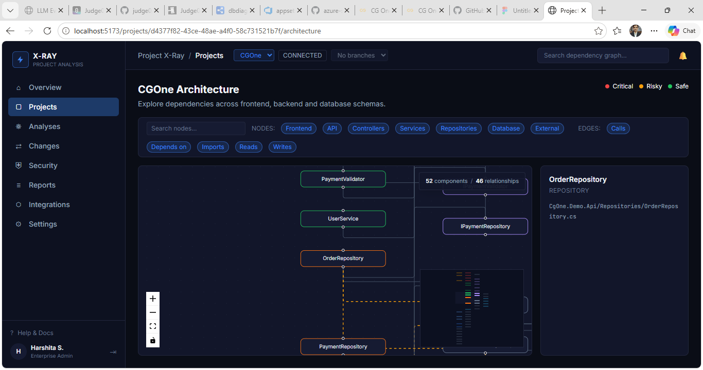
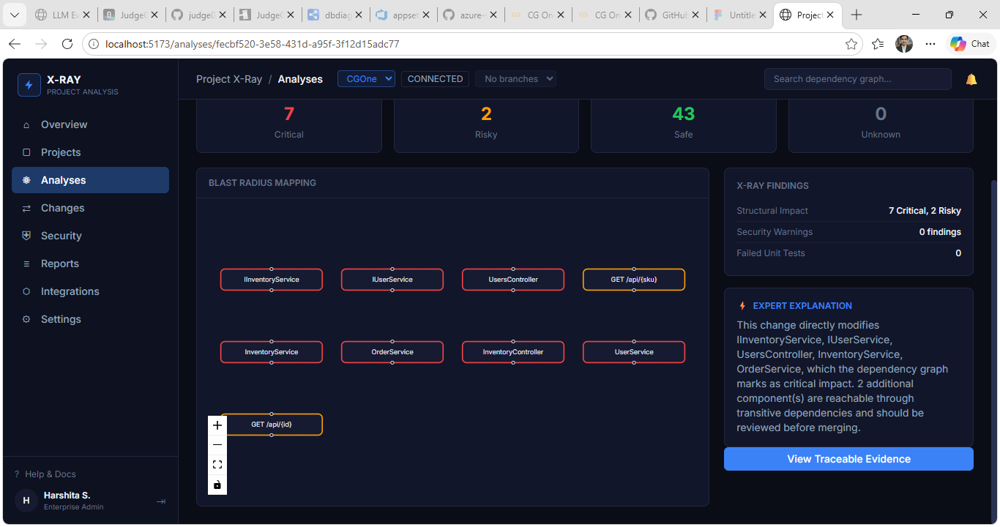
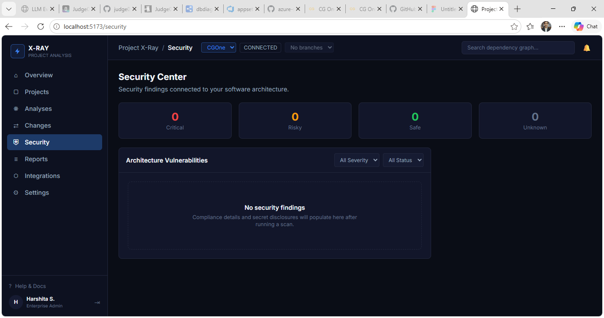
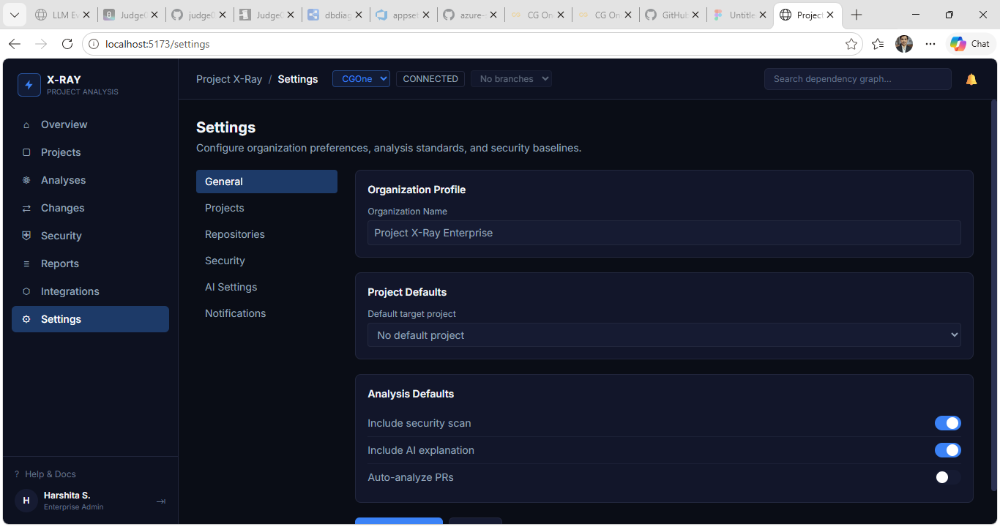
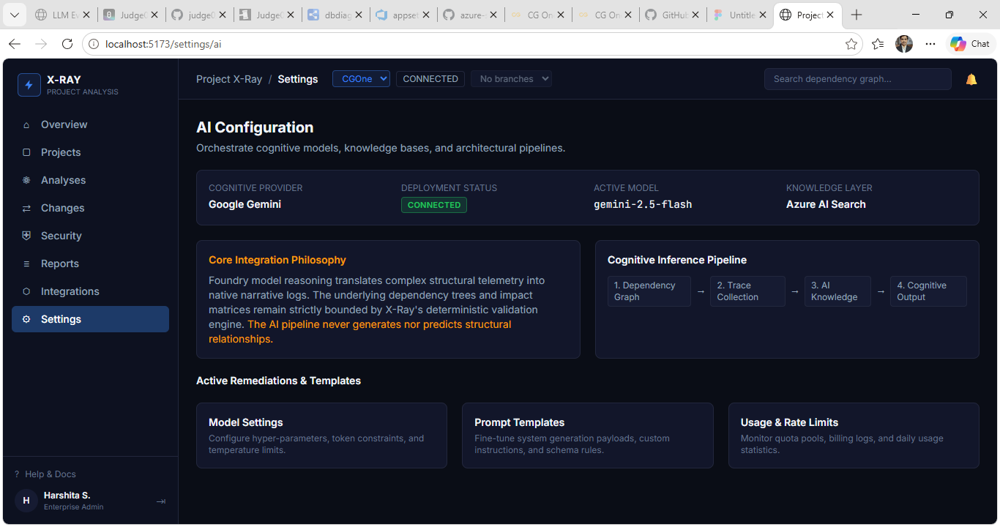

On The projects page when we see the graph of our prject with all nodes and edges. When we click on any node we see a path of the file but nothing regarding itself. I want it to show what does this node contains. Plus how and why is it connected to its next neighbours or any other critical node.

On the analysis page the it's showing how a functionality would effect other nodes. But its not doing it properly. First it removed the edges from the nodes which should not be the case. It should show the connecting edges if any and on clicking on any node it should specify why and how is it effected by the changes. Plus it should also provide the recommendation on the approaches for improvements.

Security page doesn't provide any options to do security scans. So there's nothing i could see. It should provide proper report with improvements if any.

Settings page is very messy and has many issues. Options provided in setting menu are mostly redirects so they shouldn't be there. Fix this whole page. 

The setting has AI Settings page. But it doesn't provide other options modifications. How that be handled.

### Important Remaining issues.

All graphs should show a proper legend or key
All projects should have edit delete options. 
All export button should give a proper export either in excel or in pdf.
And graph exploring is not user friendly. as its getting difficult to explore the graph as it keep growing in size.